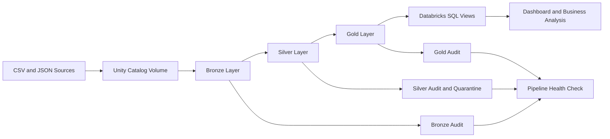
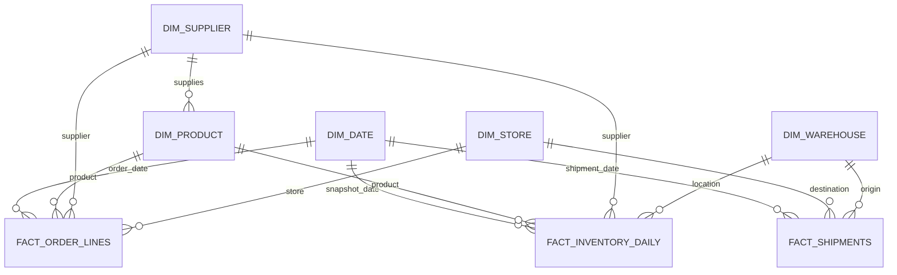
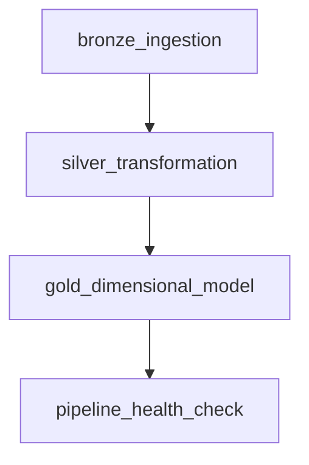

# FMCG Supply Chain Lakehouse

End-to-end data engineering project that simulates the supply chain operations of a fast-moving consumer goods company and implements a production-style Lakehouse using Databricks, PySpark, SQL, Delta Lake, Git, and automated data-quality controls.

The project was designed to demonstrate practical experience in ETL development, dimensional modeling, data profiling, pipeline orchestration, testing, validation, troubleshooting, and technical documentation.

---

## Project Overview

A consumer goods company receives operational data from multiple systems related to:

- products and suppliers;
- warehouses and retail stores;
- customer orders and order lines;
- shipments and delivery performance;
- daily inventory snapshots.

The source files contain intentional data-quality issues such as duplicate records, invalid dates, negative quantities, missing identifiers, broken foreign keys, and inconsistent inventory values.

The Lakehouse processes these files through Bronze, Silver, and Gold layers, preserving source lineage, quarantining invalid records, validating relationships, and creating business-ready supply chain metrics.

---

## Business Objectives

The platform helps answer questions such as:

- How many orders and units were processed?
- Which warehouses have the lowest OTIF performance?
- Which stores experience the largest delivery delays?
- Which products are out of stock or below their reorder point?
- What is the fill rate by warehouse, store, or carrier?
- How much revenue is generated after discounts?
- Which suppliers support the products with the highest inventory risk?
- Are all pipeline stages complete, reconciled, and healthy?

---

## Architecture



### Medallion Layers

| Layer | Purpose |
|---|---|
| Bronze | Incremental raw ingestion, source preservation, file lineage, checkpoints, and rescued data |
| Silver | Type conversion, standardization, deduplication, business rules, referential integrity, and quarantine |
| Gold | Dimensional model, business metrics, KPI views, and analytics-ready datasets |

---

## Technology Stack

| Area | Technologies |
|---|---|
| Programming | Python, PySpark |
| Querying | SQL, Spark SQL |
| Platform | Databricks Free Edition |
| Storage | Delta Lake, Unity Catalog Volumes |
| Ingestion | Databricks Auto Loader |
| Architecture | Medallion Architecture |
| Data Modeling | Star Schema |
| Orchestration | Lakeflow Jobs |
| Version Control | Git, GitHub |
| Data Quality | PySpark validation rules, reconciliation tests, audit tables |
| Documentation | Markdown, Mermaid |
| Planned CI/CD | GitHub Actions, Databricks Declarative Automation Bundles |

---

## Source Data

The project generates synthetic FMCG supply chain data for the following entities:

| Source | Description |
|---|---|
| `suppliers` | Supplier location, reliability, and lead time |
| `products` | Product, category, price, cost, weight, and supplier |
| `warehouses` | Distribution center location and capacity |
| `stores` | Store channel, location, and priority |
| `orders` | Store orders, status, dates, and source system |
| `order_items` | Products, quantities, discounts, and line amounts |
| `shipments` | Delivery dates, quantities, carrier, and shipping cost |
| `inventory_snapshots` | Daily inventory by warehouse and product |

### Intentional Data-Quality Issues

The generator includes controlled errors for validation and troubleshooting:

- duplicate orders and order lines;
- missing store identifiers;
- invalid dates;
- negative quantities and costs;
- products, stores, orders, and warehouses that do not exist;
- delivery dates before shipment dates;
- delivered quantities greater than shipped quantities;
- negative inventory;
- available inventory inconsistent with on-hand and reserved quantities.

---

## Repository Structure

```text
fmcg-supply-chain-lakehouse/
│
├── notebooks/
│   ├── 00_setup/
│   │   ├── 00_environment_setup
│   │   └── 00_volume_test
│   │
│   ├── 01_data_generation/
│   │   └── 01_generate_source_data.py
│   │
│   ├── 02_bronze/
│   │   └── 02_bronze_incremental_ingestion.py
│   │
│   ├── 03_silver/
│   │   └── 03_silver_transformation_quality_serverless.py
│   │
│   ├── 04_gold/
│   │   └── 04_gold_dimensional_model_kpis.py
│   │
│   └── 05_monitoring/
│       └── 05_pipeline_health_check.py
│
├── docs/
│   ├── architecture/
│   ├── data_dictionary/
│   └── runbook/
│
├── sql/
│   ├── profiling/
│   ├── validation/
│   └── analytics/
│
├── tests/
│   ├── unit/
│   └── integration/
│
├── resources/
├── .github/
│   └── workflows/
│
├── README.md
├── README_ES.md
├── requirements.txt
└── databricks.yml
```

> Some notebook filenames may vary depending on the final name used during development. The Job configuration must reference the exact path committed to the `main` branch.

---

## Bronze Layer

Bronze uses Auto Loader to ingest CSV and JSON files incrementally into managed Delta tables.

### Bronze Tables

```text
scm_bronze.bronze_suppliers
scm_bronze.bronze_products
scm_bronze.bronze_warehouses
scm_bronze.bronze_stores
scm_bronze.bronze_orders
scm_bronze.bronze_order_items
scm_bronze.bronze_shipments
scm_bronze.bronze_inventory_snapshots
```

### Metadata Captured

Each record contains:

```text
_source_file_path
_source_file_name
_source_file_size
_source_file_modification_time
_batch_id
_source_name
_ingestion_run_id
_ingested_at
_rescued_data
```

### Incremental Processing

Each source has an independent schema location and checkpoint. Once a file is processed, a second execution does not ingest it again.

Expected idempotency result:

```text
First execution:  input_rows > 0
Second execution: input_rows = 0
```

### Bronze Audit

```text
scm_control.bronze_load_audit
```

This table records:

- execution identifier;
- source and target table;
- input rows;
- total table rows;
- source file count;
- rescued rows;
- execution status;
- start and finish timestamps;
- error message.

---

## Silver Layer

Silver converts Bronze data into trusted, typed, standardized datasets.

### Silver Tables

```text
scm_silver.silver_suppliers
scm_silver.silver_products
scm_silver.silver_warehouses
scm_silver.silver_stores
scm_silver.silver_orders
scm_silver.silver_order_items
scm_silver.silver_shipments
scm_silver.silver_inventory_snapshots
```

### Quarantine Tables

Invalid and duplicate records are preserved instead of deleted:

```text
scm_silver.rejected_suppliers
scm_silver.rejected_products
scm_silver.rejected_warehouses
scm_silver.rejected_stores
scm_silver.rejected_orders
scm_silver.rejected_order_items
scm_silver.rejected_shipments
scm_silver.rejected_inventory_snapshots
```

Each rejected record includes:

```text
_dq_status
_dq_errors
_dq_error_count
_raw_record
_rejected_at
_source_file_name
_batch_id
```

### Main Validation Rules

Examples:

```text
quantity_ordered > 0
unit_price > 0
unit_price >= unit_cost
shipping_cost >= 0
delivered_quantity <= shipped_quantity
actual_delivery_date >= shipment_date
reserved_qty <= on_hand_qty
available_qty = on_hand_qty - reserved_qty
```

### Referential Integrity

The pipeline validates:

```text
products.supplier_id -> suppliers.supplier_id
orders.store_id -> stores.store_id
order_items.order_id -> orders.order_id
order_items.product_id -> products.product_id
shipments.order_id -> orders.order_id
shipments.warehouse_id -> warehouses.warehouse_id
inventory.product_id -> products.product_id
inventory.warehouse_id -> warehouses.warehouse_id
```

### Deduplication

Records are ranked by business key and update timestamp. The latest valid version is preserved while older copies are moved to quarantine with:

```text
DUPLICATE_BUSINESS_KEY
```

### Silver Reconciliation

Every Bronze record must be accepted or quarantined:

```text
bronze_rows = accepted_rows + rejected_rows
```

### Silver Audit

```text
scm_control.silver_load_audit
```

---

## Gold Dimensional Model

Gold presents business-ready data using a star schema.

### Dimensions

```text
scm_gold.dim_date
scm_gold.dim_supplier
scm_gold.dim_product
scm_gold.dim_store
scm_gold.dim_warehouse
```

### Facts

```text
scm_gold.fact_order_lines
scm_gold.fact_shipments
scm_gold.fact_inventory_daily
```

### Model



### Fact Granularity

| Fact Table | Grain |
|---|---|
| `fact_order_lines` | One row per product line in an order |
| `fact_shipments` | One row per shipment |
| `fact_inventory_daily` | One row per date, warehouse, and product |

### Surrogate Keys

Stable BIGINT surrogate keys are generated using `xxhash64`:

```text
product_key
supplier_key
store_key
warehouse_key
order_line_key
shipment_key
inventory_key
```

---

## Business Metrics

### Order Metrics

- units ordered;
- gross sales;
- total discounts;
- net sales;
- average discount rate.

### Delivery Metrics

- units shipped;
- units delivered;
- fill rate;
- delivery lead time;
- delay days;
- on-time delivery rate;
- in-full delivery rate;
- OTIF.

### Inventory Metrics

- on-hand inventory;
- reserved inventory;
- available inventory;
- stockout positions;
- products below reorder point;
- inventory risk status.

### OTIF Definition

```text
OTIF = On Time AND In Full
```

An order is considered OTIF when the shipment is delivered no later than the requested date and the delivered quantity is at least equal to the shipped quantity.

---

## Business Views

```text
scm_gold.vw_executive_supply_chain_kpis
scm_gold.vw_warehouse_delivery_performance
scm_gold.vw_product_inventory_risk
scm_gold.vw_store_order_performance
```

### Example Queries

#### Executive KPIs

```sql
SELECT *
FROM scm_gold.vw_executive_supply_chain_kpis;
```

#### Warehouses with the Lowest OTIF

```sql
SELECT *
FROM scm_gold.vw_warehouse_delivery_performance
ORDER BY otif_pct ASC;
```

#### Products at Risk of Stockout

```sql
SELECT *
FROM scm_gold.vw_product_inventory_risk
ORDER BY inventory_status, available_qty;
```

#### Highest-Revenue Stores

```sql
SELECT *
FROM scm_gold.vw_store_order_performance
ORDER BY net_sales DESC;
```

---

## Pipeline Orchestration

The complete workflow is orchestrated as a Lakeflow Job.



Recommended configuration:

```text
Maximum concurrent runs: 1
Retries per task: 1
Retry interval: 1 minute
Compute: Serverless
Git branch: main
```

The Job uses notebook paths committed to GitHub and executes each task only when the upstream task succeeds.

---

## End-to-End Health Check

The final task validates the complete Lakehouse and fails the Job when a critical condition is not met.

### Checks Performed

- expected Bronze, Silver, quarantine, and Gold objects exist;
- the latest Bronze audit contains all sources;
- the latest Silver audit contains all sources;
- the latest Gold audit contains all objects;
- the latest audit records have `SUCCESS` status;
- Bronze-to-Silver reconciliation passes;
- critical Gold tables contain records;
- the executive KPI view returns one row;
- KPI percentages remain between 0 and 100.

### Health Audit

```text
scm_control.pipeline_health_audit
```

Successful result:

```text
status = SUCCESS
failed_checks = 0
```

---

## How to Run the Project

### Prerequisites

- Databricks workspace with Serverless compute;
- Unity Catalog enabled;
- GitHub repository connected to Databricks;
- permission to create schemas, volumes, tables, views, and Jobs.

### 1. Create the Schemas

```sql
CREATE SCHEMA IF NOT EXISTS scm_bronze;
CREATE SCHEMA IF NOT EXISTS scm_silver;
CREATE SCHEMA IF NOT EXISTS scm_gold;
CREATE SCHEMA IF NOT EXISTS scm_control;
```

### 2. Create the Volumes

```sql
CREATE VOLUME IF NOT EXISTS scm_bronze.landing;
CREATE VOLUME IF NOT EXISTS scm_control.pipeline_files;
```

### 3. Generate the Source Data

Run:

```text
notebooks/01_data_generation/01_generate_source_data.py
```

### 4. Run Bronze

```text
notebooks/02_bronze/02_bronze_incremental_ingestion.py
```

### 5. Run Silver

```text
notebooks/03_silver/03_silver_transformation_quality_serverless.py
```

### 6. Run Gold

```text
notebooks/04_gold/04_gold_dimensional_model_kpis.py
```

### 7. Run the Health Check

```text
notebooks/05_monitoring/05_pipeline_health_check.py
```

### 8. Create the Lakeflow Job

Configure the following dependency chain:

```text
bronze_ingestion
    -> silver_transformation
        -> gold_dimensional_model
            -> pipeline_health_check
```

---

## Automated Tests

The notebooks include assertions for:

- Bronze/Silver row reconciliation;
- complete and unique business keys;
- referential integrity;
- Gold/Silver fact reconciliation;
- unique dimensional surrogate keys;
- valid fact-to-dimension relationships;
- nonnegative measures;
- fill rate between 0 and 1;
- KPI percentages between 0 and 100;
- end-to-end pipeline health.

A failed assertion causes the notebook or workflow task to fail, preventing invalid results from being delivered silently.

---

## Troubleshooting

### Job Cannot Find a Notebook

Confirm that:

- the file exists in GitHub;
- it is committed and pushed to the `main` branch;
- the Job path matches the exact filename;
- the path is relative and does not start with `/` or `./`;
- the Job identity has access to the repository.

Example:

```text
notebooks/02_bronze/02_bronze_incremental_ingestion.py
```

### Serverless Does Not Support Cache

The Silver notebook avoids:

```python
df.cache()
df.persist()
df.unpersist()
df.checkpoint()
```

Serverless-compatible code keeps DataFrames lazy and allows Spark to recompute the small development dataset when necessary.

### Bronze Processes Zero New Rows

This is expected after the first successful run:

```text
input_rows = 0
```

Auto Loader checkpoints prevent previously processed files from being ingested twice.

### Resetting a Development Layer

Use reset flags only when intentionally rebuilding development tables:

```python
RESET_BRONZE = True
RESET_SILVER = True
```

Return them to `False` before committing to Git.

---

## Screenshots

Add portfolio screenshots to `docs/images/` and update the paths below.

### Lakeflow Job DAG

```markdown

```

### Successful Workflow Run

```markdown

```

### Executive KPI View

```markdown

```

### Rejected Records

```markdown

```

---

## Project Results

This project demonstrates the ability to:

- design an end-to-end Lakehouse;
- implement incremental ETL pipelines;
- work with Databricks, PySpark, Spark SQL, and Delta Lake;
- validate data through profiling and business rules;
- preserve invalid records for troubleshooting;
- create a star schema and analytical data marts;
- implement audit tables and automated quality gates;
- orchestrate multi-task workflows;
- use Git and GitHub for version control;
- translate supply chain requirements into technical deliverables.

---

## Resume Description

> Built an end-to-end FMCG supply chain Lakehouse using Databricks, PySpark, Spark SQL, Delta Lake, and Unity Catalog. Implemented incremental Auto Loader ingestion, typed Silver transformations, deduplication, referential-integrity checks, quarantine tables, a Gold star schema, supply chain KPIs, workflow orchestration, execution auditing, and automated end-to-end quality gates.

---

## Future Improvements

- generate multiple incremental source batches;
- add Slowly Changing Dimension Type 2 logic;
- implement Databricks Declarative Automation Bundles;
- add GitHub Actions for automated validation;
- add unit tests with `pytest`;
- build a Databricks SQL dashboard;
- add data observability metrics and alerts;
- optimize large tables with liquid clustering;
- add streaming ingestion;
- document operational recovery procedures;
- add a bilingual data dictionary.

---

## Author

**Samuel Bosquez**

Data Engineering and Analytics Portfolio Project

---

## Disclaimer

This project uses synthetic data created for educational and portfolio purposes. It is not affiliated with, endorsed by, or based on internal data from P&G or any other company.
